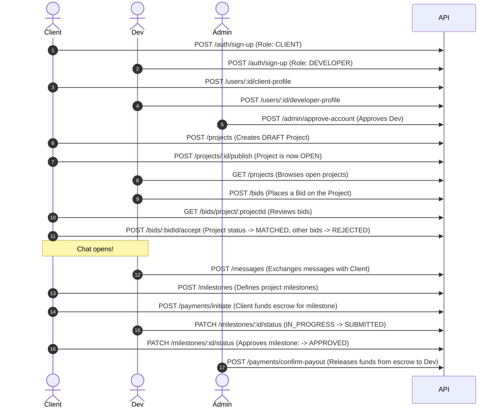

# PataDev Ke - Project & API Documentation

This document provides a comprehensive overview of the **PataDev Ke** backend service. It details the project objectives, architecture, module layout, database schema, and acts as an API Route Reference guide for frontend developers and team members.

---

## 1. Project Overview & Objectives

**PataDev Ke** is a developer-to-business matching and project management platform. Its primary goal is to connect local businesses in Kenya (seeking CRM or POS systems) with qualified software developers. 

The platform does not merely act as a directory; it handles the entire lifecycle of a project build:
1. **Brief & Matching**: Clients publish project briefs. Developers submit bids.
2. **Messaging & Collaboration**: Once a bid is accepted, a secure message channel opens between the developer and the client.
3. **Milestone Management**: The project is divided into distinct payment/work milestones.
4. **Payment Intermediation**: The platform acts as a trusted escrow intermediary. Clients pay for milestones, funds are held by the platform, and are subsequently disbursed to developers upon milestone approval (manually confirmed by administrators during the MVP stage).

### System Roles
*   **`CLIENT`**: Represents the business owner. They create projects, review bids, accept/decline bids, manage milestones (approve them), and initiate payments.
*   **`DEVELOPER`**: Represents the freelance engineer. They browse open projects, place bids, message clients (once matched), work on milestones, and submit them for review.
*   **`ADMIN`**: Represents platform administrators. They approve developer accounts, moderate listing content, and confirm financial payouts.

---

## 2. Architecture & Module Design

The codebase is built on **NestJS** and uses **Prisma** as the ORM to interact with a **Supabase (PostgreSQL)** database. 

### Module Layout
Every feature module under [src/modules/](file:///home/lawrence/Projects/attach/PataDev-ke/src/modules) adheres to a strict layered structure:
*   `controller/`: Handles incoming HTTP requests, defines routes, validates input using DTOs, and attaches Swagger documentation.
*   `service/`: House of business logic, state transitions, and rules.
*   `dto/`: Request/Response schemas, decorated with `class-validator` rules and `@ApiProperty` decorators.
*   `repository/`: Standardized database access queries using Prisma. Contains no business logic.
*   `guards/`: Route-level access control specific to the module (e.g., verifying if the user is the project owner or if a bid was accepted).
*   `strategies/`: Passport strategies (mainly inside the authentication module).
*   `helpers/`: Pure utility functions supporting the service layer (calculations, status checks, etc.).

### Module Ownership & Split
*   **Auth & User Profiles**: Derrick
*   **Projects & Matching**: Melvin
*   **Milestones & Notifications**: Peter
*   **Payments & Messaging**: Lawrence
*   **Admin & Shared Infrastructure**: Shared / Team Lead

### Module Dependency Flow
Because of database constraints and business workflows, modules must be built/interfaced in this specific order:
`Auth` $\rightarrow$ `Users` $\rightarrow$ `Projects` $\rightarrow$ `Bids` $\rightarrow$ `Messages` (gated on bid status) $\rightarrow$ `Milestones` $\rightarrow$ `Payments`

---

## 3. Database Schema Overview

The database models are configured in [schema.prisma](file:///home/lawrence/Projects/attach/PataDev-ke/prisma/schema.prisma). Below is a summary of the core models and their relationships:

| Model | Description | Relations / Keys |
| :--- | :--- | :--- |
| **`User`** | Primary auth record. Stores email, Supabase ID, and role. | Linked to `ClientProfile`, `DeveloperProfile`, `Bid`, `Message`, `Notification` |
| **`ClientProfile`** | Business profile details for Client users. | Belongs to `User`, has many `Project`s |
| **`DeveloperProfile`** | Professional profile details for Developer users. | Belongs to `User` |
| **`Project`** | Represents a system build request (CRM or POS). | Created by `ClientProfile`, has many `Bid`s |
| **`Bid`** | A developer's proposal for a project. | Belongs to `Project` and `User` (Developer), has many `Milestone`s, `Message`s, `LedgerEntry`s |
| **`Milestone`** | A discrete phase of project delivery. | Belongs to `Bid`, has many `LedgerEntry`s |
| **`Message`** | An instant message exchanged between matched users. | Belongs to `Bid` (chat room thread) and `User` (Sender) |
| **`LedgerEntry`** | Financial tracking of deposits, commissions, payouts, and refunds. | Belongs to `Bid` and `Milestone` |
| **`Notification`** | System alerts sent to users regarding status changes. | Belongs to `User` |

---

## 4. API Route Reference

All endpoints are hosted at the root (`http://localhost:3000`). Swagger documentation is auto-generated and interactive at `http://localhost:3000/api/docs`.

### Authentication Required (`@UseGuards(JwtAuthGuard)`)
Most routes (except Health and Auth) require an `Authorization` header containing a valid Bearer token:
`Authorization: Bearer <JWT_TOKEN>`

---

### 4.1 Health Check Module
Used by hosting services (Render/Railway) to verify if the server is healthy.

#### `GET /health`
*   **Access**: Public (No Auth required)
*   **Guard**: None
*   **Controller**: [HealthController](file:///home/lawrence/Projects/attach/PataDev-ke/src/common/health/health.controller.ts)
*   **Response**: `{ "status": "ok" }`

---

### 4.2 Authentication Module
Handles onboarding and login. Uses Supabase Auth under the hood.

#### `POST /auth/sign-up`
*   **Access**: Public
*   **Guard**: None
*   **Controller**: [AuthController](file:///home/lawrence/Projects/attach/PataDev-ke/src/modules/auth/controller/auth.controller.ts)
*   **Request Body (`SignUpDto`)**:
    ```json
    {
      "email": "client@business.co.ke",
      "password": "strongpassword123",
      "role": "CLIENT" // or "DEVELOPER"
    }
    ```
*   **Response**: `AuthResponseDto` (contains user info and JWT access token)

#### `POST /auth/sign-in`
*   **Access**: Public
*   **Guard**: None
*   **Controller**: [AuthController](file:///home/lawrence/Projects/attach/PataDev-ke/src/modules/auth/controller/auth.controller.ts)
*   **Request Body (`SignInDto`)**:
    ```json
    {
      "email": "client@business.co.ke",
      "password": "strongpassword123"
    }
    ```
*   **Response**: `AuthResponseDto` (contains user info and JWT access token)

---

### 4.3 Users & Profiles Module
Manages creation and lookup of role-specific profile details.

#### `GET /users/:id`
*   **Access**: Authenticated
*   **Guard**: `JwtAuthGuard`
*   **Controller**: [UsersController](file:///home/lawrence/Projects/attach/PataDev-ke/src/modules/users/controller/users.controller.ts)
*   **Parameters**: `id` (User UUID)
*   **Response**: User object with nested profiles if they exist.

#### `POST /users/:id/client-profile`
*   **Access**: Authenticated (User ID in path must match the JWT user)
*   **Guard**: `JwtAuthGuard`
*   **Controller**: [UsersController](file:///home/lawrence/Projects/attach/PataDev-ke/src/modules/users/controller/users.controller.ts)
*   **Parameters**: `id` (User UUID)
*   **Request Body (`CreateClientProfileDto`)**:
    ```json
    {
      "businessName": "Jaza Retailers Ltd",
      "businessType": "Retail", // Optional
      "phone": "+254712345678" // Optional
    }
    ```
*   **Response**: Created client profile object.

#### `POST /users/:id/developer-profile`
*   **Access**: Authenticated (User ID in path must match the JWT user)
*   **Guard**: `JwtAuthGuard`
*   **Controller**: [UsersController](file:///home/lawrence/Projects/attach/PataDev-ke/src/modules/users/controller/users.controller.ts)
*   **Parameters**: `id` (User UUID)
*   **Request Body (`CreateDeveloperProfileDto`)**:
    ```json
    {
      "displayName": "Jane Wanjiru",
      "bio": "Full-stack developer with 4 years experience.", // Optional
      "techStack": ["React", "NestJS", "PostgreSQL"],
      "portfolioUrl": "https://janewanjiru.dev" // Optional
    }
    ```
*   **Response**: Created developer profile object.

---

### 4.4 Projects Module
Allows clients to request builds and developers to search for work.

#### `POST /projects`
*   **Access**: Authenticated `CLIENT`
*   **Guard**: `JwtAuthGuard`, `RolesGuard` (`@Roles('CLIENT')`)
*   **Controller**: [ProjectsController](file:///home/lawrence/Projects/attach/PataDev-ke/src/modules/projects/controller/projects.controller.ts)
*   **Request Body (`CreateProjectDto`)**:
    ```json
    {
      "title": "Retail POS System",
      "description": "Need a point-of-sale system that supports M-Pesa integration and offline caching.",
      "systemType": "POS", // "POS" or "CRM"
      "budgetMin": 50000, // Optional
      "budgetMax": 120000 // Optional
    }
    ```
*   **Response**: Created project brief in `DRAFT` status.

#### `GET /projects`
*   **Access**: Authenticated
*   **Guard**: `JwtAuthGuard`, `RolesGuard`
*   **Controller**: [ProjectsController](file:///home/lawrence/Projects/attach/PataDev-ke/src/modules/projects/controller/projects.controller.ts)
*   **Query Parameters (`ProjectFilterDto`)**:
    *   `systemType`: `"POS"` or `"CRM"` (Optional)
    *   `status`: `"DRAFT"`, `"OPEN"`, `"MATCHED"`, `"COMPLETED"`, `"CANCELLED"` (Optional)
    *   `search`: Text search string for title and description (Optional)
    *   `budgetMin`: Minimum budget constraint (Optional)
    *   `budgetMax`: Maximum budget constraint (Optional)
    *   `page`: Page number, defaults to `1` (Optional)
    *   `pageSize`: Number of projects per page, capped at `50`, defaults to `20` (Optional)
*   **Response**: Paginated list of open/published projects.

#### `GET /projects/:id`
*   **Access**: Authenticated
*   **Guard**: `JwtAuthGuard`, `RolesGuard`
*   **Controller**: [ProjectsController](file:///home/lawrence/Projects/attach/PataDev-ke/src/modules/projects/controller/projects.controller.ts)
*   **Parameters**: `id` (Project UUID)
*   **Response**: Complete project details.

#### `PATCH /projects/:id`
*   **Access**: Authenticated `CLIENT` (Must own the project)
*   **Guard**: `JwtAuthGuard`, `RolesGuard` (`@Roles('CLIENT')`), `ProjectOwnerGuard`
*   **Controller**: [ProjectsController](file:///home/lawrence/Projects/attach/PataDev-ke/src/modules/projects/controller/projects.controller.ts)
*   **Parameters**: `id` (Project UUID)
*   **Request Body (`UpdateProjectDto`)**: Partial fields of `CreateProjectDto`.
*   **Response**: Updated project details.
*   **Note**: Edits are frozen once a project is `MATCHED`.

#### `POST /projects/:id/publish`
*   **Access**: Authenticated `CLIENT` (Must own the project)
*   **Guard**: `JwtAuthGuard`, `RolesGuard` (`@Roles('CLIENT')`), `ProjectOwnerGuard`
*   **Controller**: [ProjectsController](file:///home/lawrence/Projects/attach/PataDev-ke/src/modules/projects/controller/projects.controller.ts)
*   **Parameters**: `id` (Project UUID)
*   **Response**: Updated project with status set to `OPEN`.

#### `POST /projects/:id/cancel`
*   **Access**: Authenticated `CLIENT` (Must own the project)
*   **Guard**: `JwtAuthGuard`, `RolesGuard` (`@Roles('CLIENT')`), `ProjectOwnerGuard`
*   **Controller**: [ProjectsController](file:///home/lawrence/Projects/attach/PataDev-ke/src/modules/projects/controller/projects.controller.ts)
*   **Parameters**: `id` (Project UUID)
*   **Response**: Updated project with status set to `CANCELLED`.

---

### 4.5 Bids Module
Allows matching developer proposals to project requirements.

#### `POST /bids`
*   **Access**: Authenticated `DEVELOPER`
*   **Guard**: `JwtAuthGuard`, `RolesGuard` (`@Roles('DEVELOPER')`)
*   **Controller**: [BidsController](file:///home/lawrence/Projects/attach/PataDev-ke/src/modules/bids/controller/bids.controller.ts)
*   **Request Body (`CreateBidDto`)**:
    ```json
    {
      "projectId": "project-uuid-here",
      "proposedAmount": 75000,
      "message": "I have previously built POS systems for supermarkets in Nairobi." // Optional
    }
    ```
*   **Response**: Created bid in `PENDING` status.
*   **Note**: Enforces that the project status is `OPEN`, the developer does not own the project, and only one pending bid per developer is allowed on a project.

#### `GET /bids/project/:projectId`
*   **Access**: Authenticated
*   **Guard**: `JwtAuthGuard`, `RolesGuard`
*   **Controller**: [BidsController](file:///home/lawrence/Projects/attach/PataDev-ke/src/modules/bids/controller/bids.controller.ts)
*   **Parameters**: `projectId` (Project UUID)
*   **Response**: List of bids submitted for the project.

#### `POST /bids/:id/accept`
*   **Access**: Authenticated `CLIENT` (Must own the project linked to the bid)
*   **Guard**: `JwtAuthGuard`, `RolesGuard` (`@Roles('CLIENT')`), `BidProjectClientGuard`
*   **Controller**: [BidsController](file:///home/lawrence/Projects/attach/PataDev-ke/src/modules/bids/controller/bids.controller.ts)
*   **Parameters**: `id` (Bid UUID)
*   **Response**: Updated bid object.
*   **Note**: Accepting a bid automatically sets that bid to `ACCEPTED`, sets all other pending bids on that project to `REJECTED`, and sets the project status to `MATCHED`.

#### `POST /bids/:id/decline`
*   **Access**: Authenticated `CLIENT` (Must own the project linked to the bid)
*   **Guard**: `JwtAuthGuard`, `RolesGuard` (`@Roles('CLIENT')`), `BidProjectClientGuard`
*   **Controller**: [BidsController](file:///home/lawrence/Projects/attach/PataDev-ke/src/modules/bids/controller/bids.controller.ts)
*   **Parameters**: `id` (Bid UUID)
*   **Response**: Updated bid object with status set to `REJECTED`.

---

### 4.6 Messages (Chat) Module
Provides direct client-developer communication once matched.

#### `POST /messages`
*   **Access**: Authenticated `CLIENT` or `DEVELOPER` (User must be part of the accepted bid conversation)
*   **Guard**: `JwtAuthGuard`, `BidAcceptedGuard`
*   **Controller**: [MessagesController](file:///home/lawrence/Projects/attach/PataDev-ke/src/modules/messages/controller/messages.controller.ts)
*   **Request Body (`SendMessageDto`)**:
    ```json
    {
      "bidId": "accepted-bid-uuid",
      "content": "Hi, let's discuss the first milestone details."
    }
    ```
*   **Response**: Created message object.
*   **Note**: Restricts chat context strictly to bids that have been `ACCEPTED`.

#### `GET /messages/bid/:bidId`
*   **Access**: Authenticated `CLIENT` or `DEVELOPER` (User must be part of the accepted bid conversation)
*   **Guard**: `JwtAuthGuard`, `BidAcceptedGuard`
*   **Controller**: [MessagesController](file:///home/lawrence/Projects/attach/PataDev-ke/src/modules/messages/controller/messages.controller.ts)
*   **Parameters**: `bidId` (Bid UUID)
*   **Response**: Array of chronological messages in the thread.

---

### 4.7 Milestones Module
Handles stage-by-stage definition and progression of project deliverables.

#### `POST /milestones`
*   **Access**: Authenticated
*   **Guard**: `JwtAuthGuard`
*   **Controller**: [MilestonesController](file:///home/lawrence/Projects/attach/PataDev-ke/src/modules/milestones/controller/milestones.controller.ts)
*   **Request Body (`CreateMilestoneDto`)**:
    ```json
    {
      "bidId": "accepted-bid-uuid",
      "title": "Database Schema & Supabase Setup",
      "description": "Establish PostgreSQL tables, configure Supabase Auth integration.", // Optional
      "amount": 25000,
      "dueDate": "2026-09-15T12:00:00.000Z" // Optional ISO string
    }
    ```
*   **Response**: Created milestone object in `PENDING` status.

#### `GET /milestones/bid/:bidId`
*   **Access**: Authenticated
*   **Guard**: `JwtAuthGuard`
*   **Controller**: [MilestonesController](file:///home/lawrence/Projects/attach/PataDev-ke/src/modules/milestones/controller/milestones.controller.ts)
*   **Parameters**: `bidId` (Bid UUID)
*   **Response**: Array of milestones linked to the bid.

#### `PATCH /milestones/:id/status`
*   **Access**: Authenticated `CLIENT` or `DEVELOPER` (User must be the client/developer tied to the milestone's project)
*   **Guard**: `JwtAuthGuard`, `MilestoneAccessGuard`
*   **Controller**: [MilestonesController](file:///home/lawrence/Projects/attach/PataDev-ke/src/modules/milestones/controller/milestones.controller.ts)
*   **Parameters**: `id` (Milestone UUID)
*   **Request Body (`UpdateMilestoneStatusDto`)**:
    ```json
    {
      "status": "IN_PROGRESS" // "PENDING", "IN_PROGRESS", "SUBMITTED", "APPROVED"
    }
    ```
*   **Response**: Updated milestone details.

---

### 4.8 Payments Module
Controls escrow financial movement.

#### `POST /payments/initiate`
*   **Access**: Authenticated
*   **Guard**: `JwtAuthGuard`
*   **Controller**: [PaymentsController](file:///home/lawrence/Projects/attach/PataDev-ke/src/modules/payments/controller/payments.controller.ts)
*   **Request Body (`InitiatePaymentDto`)**:
    ```json
    {
      "bidId": "accepted-bid-uuid",
      "amount": 25000
    }
    ```
*   **Response**: Success indicator. Creates a `LedgerEntry` of type `HELD` in `PENDING` status representing client escrow.

#### `POST /payments/confirm-payout`
*   **Access**: Authenticated `ADMIN`
*   **Guard**: `JwtAuthGuard`, `AdminOnlyGuard`
*   **Controller**: [PaymentsController](file:///home/lawrence/Projects/attach/PataDev-ke/src/modules/payments/controller/payments.controller.ts)
*   **Request Body (`PayoutConfirmationDto`)**:
    ```json
    {
      "milestoneId": "milestone-uuid-here"
    }
    ```
*   **Response**: Confirmation log. Adjusts ledger statuses, indicating developer disbursement.

#### `GET /payments/bid/:bidId`
*   **Access**: Authenticated
*   **Guard**: `JwtAuthGuard`
*   **Controller**: [PaymentsController](file:///home/lawrence/Projects/attach/PataDev-ke/src/modules/payments/controller/payments.controller.ts)
*   **Parameters**: `bidId` (Bid UUID)
*   **Response**: Array of ledger entries linked to the bid.

---

### 4.9 Admin Module
Restricted operations for managing platform listings and users.

#### `POST /admin/approve-account`
*   **Access**: Authenticated `ADMIN`
*   **Guard**: `JwtAuthGuard`, `RolesGuard` (`@Roles('ADMIN')`)
*   **Controller**: [AdminController](file:///home/lawrence/Projects/attach/PataDev-ke/src/modules/admin/controller/admin.controller.ts)
*   **Request Body (`ApproveAccountDto`)**:
    ```json
    {
      "userId": "user-uuid-to-approve"
    }
    ```
*   **Response**: Success confirmation.

#### `POST /admin/moderate-listing`
*   **Access**: Authenticated `ADMIN`
*   **Guard**: `JwtAuthGuard`, `RolesGuard` (`@Roles('ADMIN')`)
*   **Controller**: [AdminController](file:///home/lawrence/Projects/attach/PataDev-ke/src/modules/admin/controller/admin.controller.ts)
*   **Request Body (`ModerateListingDto`)**:
    ```json
    {
      "projectId": "project-uuid-to-moderate",
      "action": "APPROVE" // or "REMOVE"
    }
    ```
*   **Response**: Success confirmation.

---

### 4.10 Notifications Module
Informs users of real-time state changes.

#### `GET /notifications`
*   **Access**: Authenticated
*   **Guard**: `JwtAuthGuard`
*   **Controller**: [NotificationsController](file:///home/lawrence/Projects/attach/PataDev-ke/src/modules/notifications/controller/notifications.controller.ts)
*   **Response**: Array of notifications belonging to the logged-in user.

---

## 5. End-to-End Workflow Guide

Here is how a project moves through the platform step-by-step:


