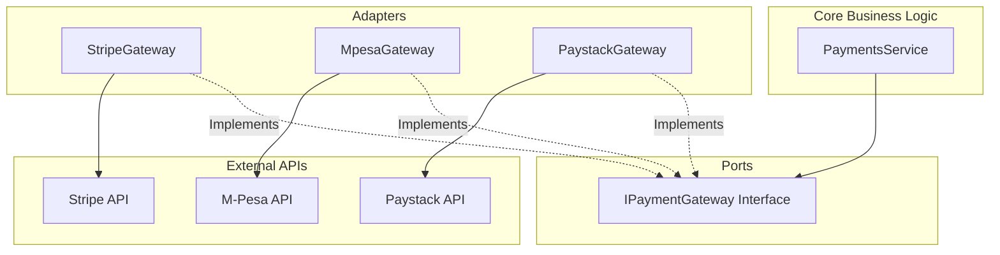

# Payments Module Requirements & Implementation Gap Analysis

This document details the assessment of the existing codebase for **PataDev Ke** and identifies what is required to implement a robust, maintainable, and production-ready **Payments Module** under a boring, conventional, and decoupled architecture.

---

## 1. Current State Assessment

Currently, the payments module exists as a skeleton structure under [src/modules/payments/](file:///home/lawrence/Projects/attach/PataDev-ke/src/modules/payments/). Here is what has been built so far:

*   **Database Schema (`schema.prisma`)**:
    *   Includes models for `LedgerEntry` (tracking `HELD`, `COMMISSION`, `PAYOUT`, `REFUND`), `PlatformSetting` (for configuration keys like `commission_rate`), and `Milestone`.
    *   Ledger entries have an `idempotencyKey` field constraint.
*   **Controller Endpoints**:
    *   `POST /payments/initiate`: Creates a `HELD` ledger entry in `PENDING` status.
    *   `POST /payments/confirm-payout`: Admin-only endpoint that releases funds by writing `COMMISSION` (completed) and `PAYOUT` (pending) records to the ledger.
    *   `GET /payments/bid/:bidId`: Fetches history.
*   **Services and Repositories**:
    *   `PaymentsService` and `PaymentsRepository` perform basic CRUD operations on ledger entries inside a Prisma transaction wrapper for the payout logic.
*   **Helpers**:
    *   `commission.helper.ts` contains a basic multiplier logic `Math.round(amount * rate * 100) / 100`.
    *   `ledger.helper.ts` documents the high-level workflow.

---

## 2. Structural & Architectural Gaps

While the database models and route layouts are established, they are currently mock database structures that do not interface with external payment rails. To move this module to production grade, the following gaps must be resolved:

### A. Lack of Real Payment Gateway Integrations
*   **The Issue**: The `initiate` and `confirmPayout` methods only create database rows. No funds are actually moved.
*   **The Solution**: We need to integrate the third-party providers configured in `.env` (`Stripe`, `Paystack`, and `M-Pesa`).

### B. Missing Webhook Handlers (Inbound Escrow)
*   **The Issue**: Escrow deposits (`initiate`) are marked `PENDING` but there is no mechanism to mark them `COMPLETED` once the client actually pays.
*   **The Solution**: A public webhook controller is required to receive asynchronous payment notifications from the gateways, verify their authenticity (e.g. signature verification), and resolve the `HELD` ledger entry status.

### C. Financial Integrity & Security Vulnerabilities
*   **Critical Vulnerability (Unfunded Payouts)**: The `confirmPayout` service does not check if the client *actually funded* the escrow before releasing the payout. An administrator could trigger a payout on an unpaid milestone, causing the platform to disburse its own money.
    *   *Fix*: We must query the `LedgerEntry` table to verify that a `HELD` record in `COMPLETED` status exists for the corresponding `bidId` and `milestoneId`, and that its amount matches the milestone amount.
*   **Floating Point Inaccuracy**: Currency handling currently relies on the TypeScript `number` type. JavaScript floating-point arithmetic can introduce rounding errors in financial transactions.
    *   *Fix*: We should handle all monetary calculations using minor units (e.g., cents for USD, shillings as integers for KES) or utilize a library like `decimal.js` alongside Prisma's `Decimal` type.
*   **Lack of Gateway Idempotency**: While the repository checks for local database idempotency, it does not forward idempotency keys to the external payment provider APIs. Double-submitting a payout on gateway connection failure could disburse funds twice.
    *   *Fix*: Pass the `idempotencyKey` to Stripe (`Idempotency-Key` header) and equivalent parameters to Paystack/M-Pesa.

### D. Hardcoded Lifecycle States & Missing Events
*   **The Issue**: In `milestones.controller.ts`, the transition is mock-called with a hardcoded `PENDING` status. There is also a `TODO` to emit an event when a milestone is approved.
*   **The Solution**:
    *   Fetch the actual current status of the milestone from the DB before attempting transition checks.
    *   Utilize an Event Emitter pattern (NestJS `@nestjs/event-emitter`) to notify the payments module when a milestone changes state. For instance, when a milestone is `APPROVED` by a client, it should trigger the ledger preparation for payout automatically.

### E. Missing Refund & Dispute Flow
*   **The Issue**: The database schema allows a `REFUND` type ledger entry, but there is no corresponding controller, service logic, or gateway implementation to perform refunds.
*   **The Solution**: Implement admin endpoints to reverse a transaction if a dispute is resolved in favor of the client, communicating with the gateway's refund endpoint and writing the appropriate `REFUND` entries.

---

## 3. Proposed Conventional Architecture

To optimize for maintainability and enforce clear boundaries, we propose a standard **Ports and Adapters (Hexagonal)** architecture style for payment provider integrations.



### Key Components

1.  **`IPaymentGateway` (Port)**:
    An abstract service class (or TypeScript interface) defining the core contract:
    ```typescript
    export interface IPaymentGateway {
      createCheckoutSession(amount: number, referenceId: string, clientEmail?: string): Promise<CheckoutSessionResult>;
      initiateTransfer(amount: number, recipientDetails: any, idempotencyKey: string): Promise<TransferResult>;
      verifyWebhookSignature(signature: string, payload: any): Promise<boolean>;
    }
    ```
2.  **Adapters**:
    Separate classes implementing `IPaymentGateway` for each gateway (Stripe, M-Pesa, Paystack). The core payments service will depend only on `IPaymentGateway`, injected dynamically via NestJS provider tokens depending on environment configurations or transaction route parameters.
3.  **Webhook Controllers**:
    A clean boundary for handling the raw HTTP POST requests from Stripe/Paystack/M-Pesa. Webhook controllers verify signatures, extract payloads, and delegate the status updates back to the core `PaymentsService`.
4.  **Milestone-Payment Coordination**:
    Use NestJS Event Emitters to link milestone approvals to payout preparations:
    *   `MilestonesService` emits `milestone.approved`.
    *   `PaymentsService` listens to `milestone.approved` and automatically prepares payout ledger entries in `PENDING` state, waiting for the Admin to confirm.

---

## 4. Implementation Checklist

Here is a checklist of tasks required to make the Payments module production-ready:

- [ ] **Infrastructure Setup**:
  - [ ] Configure standard gateway library dependencies (`stripe`, etc.).
  - [ ] Set up private setting schemas or database seeds to guarantee configuration availability (e.g. `commission_rate`).
- [ ] **Decoupled Interfaces**:
  - [ ] Define the `IPaymentGateway` port interface.
  - [ ] Implement `StripeGateway` adapter.
  - [ ] Implement `MpesaGateway` adapter (Lipa Na M-Pesa & B2C).
  - [ ] Implement `PaystackGateway` adapter.
- [ ] **Escrow Inbound Integration**:
  - [ ] Refactor `initiate` to trigger the payment checkout flow on the chosen gateway.
  - [ ] Create `POST /payments/webhook/:gateway` endpoints for webhook callbacks.
  - [ ] Add gateway signature verification guards.
  - [ ] Implement ledger resolution logic to set `HELD` entries to `COMPLETED` when callback returns success.
- [ ] **Disbursal Outbound Integration**:
  - [ ] Add client-side developer profile fields to store payment disbursement details (e.g., Stripe Account ID, bank details, or phone number).
  - [ ] Modify `confirmPayout` to check that the escrow was indeed completed (`HELD` status is `COMPLETED`) before proceeding.
  - [ ] Call the external gateway payout/transfer endpoint during `confirmPayout`, passing the idempotency key.
  - [ ] Mark the `PAYOUT` entry as `COMPLETED` or `FAILED` depending on gateway response.
- [ ] **Milestones Event Alignment**:
  - [ ] Update `milestones.controller.ts` to retrieve the active record's status instead of hardcoding `'PENDING'`.
  - [ ] Setup event emitter to decouple milestone approval from payments module logic.
- [ ] **Refund System**:
  - [ ] Implement `POST /payments/refund` with validation and gateway integration.
